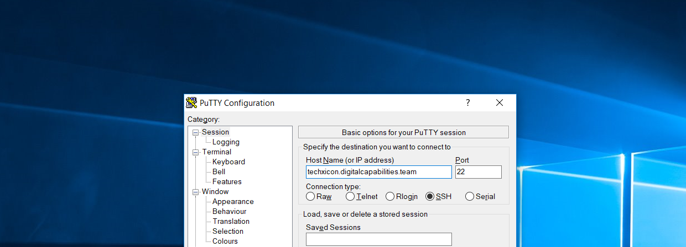

# Techxicon

Techxicon is a tech dictionary created with emphasis on simplified definitions and contextualised examples to the public service where relevant.

It is a pilot project by Digital Capabilities Team at Civil Service College, with the aim of establishing a common 'digital' language between public officers. We envision Techxicon to be a one-stop resource where public officers can search, learn, and explore technology terms and processes.

##### Features
- 200+ technology-related terms that you can search to know more about 
- Contextualised definitions and examples related to the public service
- Community-contributed definitions/resources
- Wikipedia-style link surfing

##### Architecture
- Built on Python & Django
- Data storage on Postgres
- Full-text-search via Postgres
- Runs on Gunicorn
- Web requests handled by Caddy

## Table of Contents

- [Preparation](#preparation)
  - [Domain Registration](#domain-registration)
  - [Web Hosting](#web-hosting)
  - [Accessing your virtual server via SSH](#accessing-your-virtual-server-via-ssh)
- [Installation](#installation)
  - [Assumptions](#assumptions)
  - [Step 1: Setting up your new server](#step-1-setting-up-your-new-server)
  - [Step 2: Installing database server](#step-2-installing-database-server)
  - [Step 3: Retrieve files using git](#step-3-retrieve-files-using-git)
  - [Step 4: Create a virtualenv of the project](#step-4-create-a-virtualenv-for-the-project)
  - [Step 5: Install required dependencies](#step-5-install-required-dependencies)
  - [Step 6: Initial settings](#step-6-initial-settings)
  - [Step 7: Setup webserver](#step-7-setup-webserver)
  - [Step 8: Go live!](#step-8-go-live)
- [Maintenance](#maintenance)
  - [Accessing the admin portal](#accessing-the-admin-portal)
  - [Adding new users](#adding-new-users)
  - [Adding new terms](#adding-new-terms)
  - [Editing raw code](#editing-raw-code)
- [Roadmap](#roadmap)
- [Acknowledgements](#acknowledgements)
- [License](#license)


## Preparation

### Domain Registration

At the very least, this app should have a public domain name for two main reasons:
1. An easy way for users to remember the site URL
2. Ability to use free SSL certs like [Let's Encrypt](https://letsencrypt.org/)

The current domain name `digitalcapabilities.team` is managed through [Namecheap](https://www.namecheap.com/). 

### Web Hosting

Next, the web app needs to sit somewhere but generally I would recommend it to sit on Linux server that is based in Singapore.

The current app is hosted on [DigitalOcean](https://www.digitalocean.com/). They offer Linux Virtual Private Servers (VPS), or Droplets as they call it, at an affordable rate of USD$5/month. 

### Accessing your virtual server via SSH
By default, DigitalOcean allows you to access console via browser, but it is often laggy so SSH is preferred. Assuming you are using Windows, you can download [PuTTY](https://www.putty.org/), [KiTTY](http://www.9bis.net/kitty/), or [MobaXterm](https://mobaxterm.mobatek.net/) to access it. 

##### Connecting using PuTTY Client


_Tip: It is advisable to __ONLY__ open port `22` when you need it and to block the port once you are done accessing it._

## Installation

##### Assumptions
1. Web server, database, app to be installed in a single server
2. Server is based on Debian 9.4
3. You have `root` access, or at least `sudo` access

### Step 1: Setting up your new server

Update all packages to the latest version
```shell
sudo apt-get update && sudo apt-get -y upgrade
```

Run this command to install Python (which should already have been installed) and its package manager `pip`
```shell
sudo apt install -y python3 python3-pip python3-dev
```

### Step 2: Installing database server
By default, Django uses SQLite3 as the database server. However, since we intend to use the Full Text Search function of PostgreSQL, we would need to use this instead.
For the purpose of this tutorial, we will be showing how to setup a PostgreSQL database server on the same host.

##### Installing the required packages
```shell
sudo apt install -y postgresql postgresql-contrib postgresql-doc postgresql-client
```

##### Allow PostgreSQL to be accessed outside of localhost (Optional)

First, we need to locate the directory that your postgresql is stored:
```shell
sudo find / -name postgresql.conf
```
Access the config files for postgresql
```shell
sudo nano /etc/postgresql/9.6/main/postgresql.conf
```
Uncomment the line `#listen_addresses = 'locahost'` and change it to '*'
```shell
listen_addresses = '*'
```

##### Set the appropriate authentication methods

Next, we need to change authentication methods for the users
```shell
sudo nano /etc/postgresql/9.6/main/pg_hba.conf
```

Set the auth method from `peer` to `md5` so local connections require password authentication
```shell
local    all             all                                              md5
```

Allow connections from outside of localhost by changing to `0.0.0.0/0` and `::/0`
```shell
host     all             all              0.0.0.0/0                       md5
host     all             all              ::/0                            md5
```

Restart Postgresql to reflect changes
```shell
sudo service postgresql restart
```

##### Creating users and permissions

We're going to use the default admin account `postgres` to create a new admin account. We are going to use `cscadmin` as the username; you can set the password during the prompt. The first command will create a new user in postgresql, whereas the second command will create a new database with the same name as the user, which is `cscadmin` in this case.
```shell
su - postgres -c 'createuser --interactive --pwprompt'
su - postgres -c 'createdb -O cscadmin cscadmin'
```

_Tip: If you do not have `root` access, use `sudo -u` instead of `su -`._

##### Create database schemas
Lastly, for the purpose of this webapp, we will be confining the database tables under the `techxicon` schema.
```shell
sudo psql -U cscadmin -c 'CREATE SCHEMA techxicon;'
```

For more information on how to configure a database server like PostgreSQL, visit [this article](https://www.digitalocean.com/community/tutorials/how-to-install-and-use-postgresql-on-ubuntu-18-04) on DigitalOcean would help to give you a brief introduction.

### Step 3: Retrieve files using git

The easiest way to get the files is to have `git` manage the files. You can install `git` with this command:
```shell
sudo apt install -y git
```

In your home directory, create a project folder to house the project. We will be using 'civil-service-college' in this case.
```shell
mkdir civil-service-college
cd civil-service-college
```

Clone the repository by running the following command
```shell
git clone https://github.com/loozhengyuan/techxicon.git
```

### Step 4: Create a virtualenv for the project

Next, we will be creating an isolated environment to run this app. This requires a powerful Python library called `virtualenv`. You can install it via `pip`:
```shell
sudo pip3 install virtualenv
```

We will be naming our virtualenv as `venv` and housing it in the project directory
```shell
cd techxicon
virtualenv venv
```

Activate the environment
```shell
. venv/bin/activate
```

### Step 5: Install required dependencies

To install the last-known working version of the packages, use the `requirements.txt` to install
```shell
pip install -r requirements.txt
```

_(Optional)_ If you prefer to install the up-to-date version of the packages instead, run this command instead:
```shell
pip install django psycopg2 psycopg2-binary gunicorn
```

### Step 6: Initial settings
Contrary to the default `settings.py` file generated by Django, we made the settings file into a package. 

##### Settings Directory Structure
By the end of this step, your settings directory should appear like this. All files are included, but you would need to create `production.py`.
```
# ~/civil-service-college/techxicon/techxicon/

settings
├─ __init__.py
├─ base.py
└─ production.py
```

##### Create `production.py`

Navigate to the settings directory, create file and launch it the text editor
```shell
cd ~/civil-service-college/techxicon/techxicon/settings
sudo touch production.py
sudo nano production.py
```

Paste the following code inside and edit accordingly
```shell
# ~/civil-service-college/techxicon/techxicon/settings/production.py

from .base import *

SECRET_KEY = '' # You should have this SECRET KEY, insert it here

DEBUG = False

ALLOWED_HOSTS = [
    'techxicon.digitalcapabilities.team', # Change this if your domain changes
]

CSRF_COOKIE_SECURE = True

STATIC_ROOT = '/var/www/techxicon.digitalcapabilities.team/static/'   # This too

DATABASES = {
    'default': {
        'ENGINE': 'django.db.backends.postgresql',
        'OPTIONS': {'options': '-c search_path=techxicon'},
        'NAME': 'cscadmin',
        'USER': 'cscadmin',
        'PASSWORD': 'password', # Input your password here
        'HOST': '127.0.0.1',    # If the database is hosted else, change the HOST accordingly
        'PORT': '5432',
    }
}
```

##### Initialise database tables

Django uses the settings defined in core/models.py to create tables in the database. To initialise the tables:
```shell
python manage.py makemigrations
python manage.py migrate
```

##### Create superuser

In order to access the admin panel, you would need to create a superuser. You can create superusers using this command, but do take note that these users have COMPLETE control over your project, so choose wisely who you'd like to delegate this to.
```shell
python manage.py createsuperuser
```

##### Collect staticfiles

Gunicorn manages the running of the application, but much of the static files will be hosted by a webserver. This command will collect all the static files used in your project and place them in the `STATIC_ROOT` directory that you have defined earlier.
```shell
python manage.py collectstatic
```

##### Test run

Since Techxicon runs on Django, they provided a very very good [https://docs.djangoproject.com/en/2.0/howto/deployment/checklist/](documentation) of checklist that needs to be completed before deploying. Some of these can even be automated using the following command:
```shell
python manage.py check --deploy
```

Test run the app using this command (0.0.0.0:80)
```shell
python manage.py runserver 0:80
```

### Step 7: Setup Webserver

Currently, the easiest way to deploy Techxicon is by using Caddy. Alternatively, as recommended by Gunicorn, you can deploy this on Nginx as well.

##### Installing Caddy

One-click install script by Caddy
```shell
curl https://getcaddy.com | bash -s personal
```

##### Configuring Caddy

Create and edit Caddyfile
```shell
cd ~
sudo touch Caddyfile
sudo nano Caddyfile
```

Copy and paste these settings
```shell
# ~/Caddyfile

techxicon.digitalcapabilities.team {
    proxy / localhost:8001 {
        transparent
    }
}

techxicon.digitalcapabilities.team/static {
    root /var/www/techxicon.digitalcapabilities.team/static
}

```

##### Increasing file descriptor limit

Increase file descriptor limit from 1024 to 8192 by editing the `/etc/security/limits.conf` file
```shell
sudo nano /etc/security/limits.conf
```

Add these two lines in the file:
```shell
# /etc/security/limits.conf

root               soft    nofile          8192
root               hard    nofile          8192
```

_Tip: If you do not have `root` access, you should change `root` to `*` instead._

### Step 8: Go live

_(Optional)_ Reboot server to make sure everything is in order and persists restarts
```shell
sudo reboot
```

##### Run web server
To run Caddyserver, run the `caddy` command. The `caddy` command looks for a `Caddyfile`(created in the previous step) and deploys a webserver according to the configurations in that file. Make sure that port numbers `80` and `443` are not blocked by firewall (which should not be the case by default).

```shell
screen
cd ~
caddy
```

##### Run WSGI server
Gunicorn is activated using the `gunicorn` command supplied with two main parameters. The last parameter at the back `-b 0:8001` means that Gunicorn will listen to all ip addresses `0.0.0.0` and bound to port `8001`. 

```shell
screen
cd ~/civil-service-college/techxicon
. venv/bin/activate
gunicorn techxicon.wsgi -b 0:8001
```

_Tip: If you want, you can run many instances of Django apps on the same Caddy server. This can be done by [editing the Caddyfile](#step-7-setup-webserver) and running another instance using a __different port__._

##### Managing screen sessions
In subsequent sessions, you can resume the sessions by typing the following command. This will list the session number that you should reconnect to:
```shell
screen -ls
```

For example, you would like to resume back to 1429:
```shell
screen -r 1429
```

_Tip: If you would like to exit or change session, you can do so by pressing `CTRL-A` followed by `CTRL-D`._

## Maintenance

Whatever changes you intend to make, do make sure you back up everything so that if anything goes wrong, you have a last known working copy of the files/droplet. 
This can be easily done using DigitalOcean's platform by taking snapshot of the droplet. For more information, check out DigitalOcean's [documentation page on its Snapshots](https://www.digitalocean.com/docs/images/snapshots/) feature.

### Accessing the admin portal
Majority of the customisation can be managed via the admin portal. If you would like to add word or amend the definitions, you can enter the admin portal with this url: [https://techxicon.digitalcapabilities.team/admin](https://techxicon.digitalcapabilities.team/admin)

##### Login Page


##### Dashboard


### Adding new users
Users can be easily added by navigating to the `Authentication and Authorization` page. Permissions are generally managed through `Groups`, which can be edited on the same section. Currently, there are two main groups - (1)`Administrators` and (2)`Contributors`. Once a new user has been added, assign the user to a specific group depending on your needs.

##### User List


##### Add User Page


##### Edit User Permissions


### Adding new terms
Terms are displayed on the [terms](#term-list) page; you can add or remove terms from this page. To add terms, simply click the top right hand corner of the page, where it brings to you the [add terms](#add-term-page) page. When adding or editing terms, do take note of the guidelines written below each field. It is advisable to browse multiple definitions first to understand the writing format before attempting to add new terms. Since Markdown links are programmed to be automatically converted to HTML format, it is important for one to be familiar with the hyperlink syntax for both languages. For every word added, one should search the word to ensure the content displays consistently with other terms and ensure the links are working.

##### Term List


##### Add Term Page


### Editing raw code

_Disclaimer: While some changes require changes to the code, make sure you know what you are doing because it may cause irreversible changes to the webapp. As a precausion, be sure to backup everything before you make attempt the changes._

##### Pushing changes to production server

The first step would be to look for the screen session that you initially used to run Gunicorn. This can be done by running `screen -ls` and reconnecting one by one to find the right session.
```shell
screen -ls
screen -r XXXX
```
Once you have identified the correct Gunicorn instance, press `CTRL-C` to stop the Gunicorn instance.

Using git, pull the updated changes from this or your forked repository:
```shell
git pull
```

Once all files are up-to-date, you can re-deploy using the following command:
```shell
gunicorn techxicon.wsgi -b 0:8001
```

## Roadmap

### Suggested Features
- Fuzzy search (For search with wrong spellings)
- Citations for each term
- Word-of-the-day
- 24hr word cloud
- Mouseover pop-up for hyperlinks (Using AJAX/JQuery?)
- Search completion 

## Acknowledgements

Many content posted here comes from a wealth of resources available on DigitalOcean's [docs](https://www.digitalocean.com/docs/) and [tutorials](https://www.digitalocean.com/community/tutorials) page. In addition, Django also provides a very very good [documentation](https://docs.djangoproject.com/en/2.0/) on the framework. 

Much of the feedback and word improvements are contributed by the search history and user feedback from Public Service officers. Thank you for helping us to improve the Techxicon!
 
## License

This project is licensed under the GNU GPLv3 License